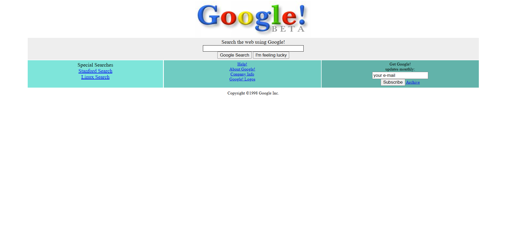

# Google 1998 Homepage Clone 

A static HTML and CSS clone of the original Google homepage from 1998. This project was built to practice foundational web development skills, specifically focusing on building classic layouts and using CSS Flexbox.

##  Project Overview

The goal of this project was to recreate the retro look and feel of the 1998 Google search page from scratch, without relying on any modern CSS frameworks. It closely matches the original spacing, color scheme, and structural alignment.

##  Technologies Used

* **HTML5:** Semantic structuring, text inputs, and classic anchor links.
* **CSS3:** Flexbox for creating the bottom three-column layout, margin/padding adjustments, and matching the retro aesthetic.

##  Key Features

* Accurate replication of the 1998 Google logo and search bar area.
* Classic "Google Search" and "I'm feeling lucky" buttons.
* Bottom section divided into three equal columns using modern `flexbox` (replacing the old 1998 HTML table layouts).
* Authentic vintage color palette (`#EEEEEE` for the search box, `#7EE5DA` for the links container, etc.).

##  How to Run

1.  Clone this repository to your local machine:
    ```bash
    git clone <your-github-repo-url>
    ```
2.  Navigate to the project folder.
3.  Simply open the `index.html` file in any modern web browser to view the page. No local server is required.




---
*This project was created as an assignment to practice HTML/CSS basics.*